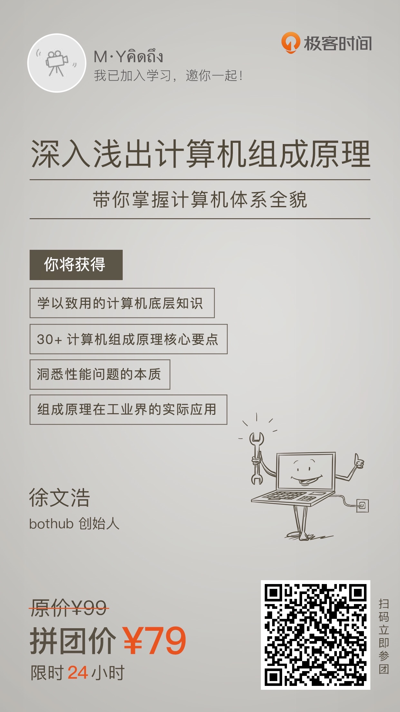
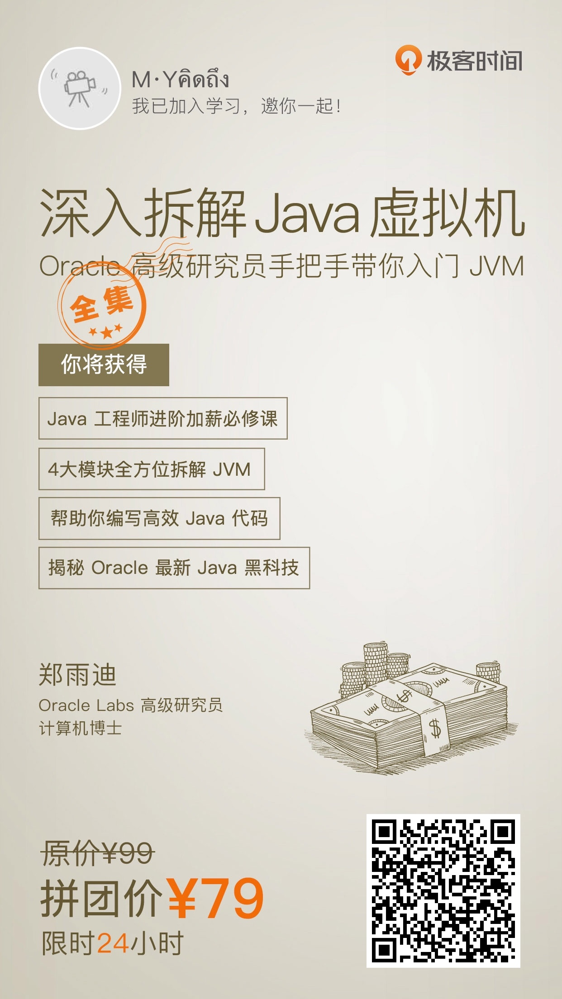
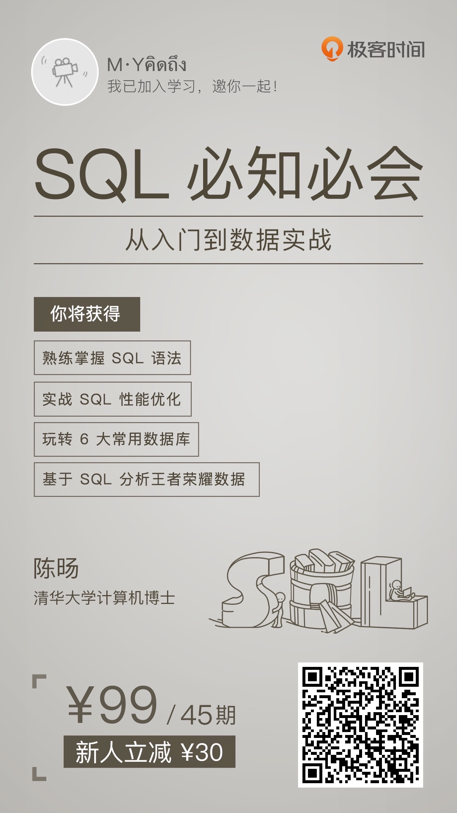

# 极客时间


[极客时间官网](https://time.geekbang.org/)

[极客时间APP下载](https://time.geekbang.org/download)

扫码关注极客时间服务号


感谢支持，不胜感激！😄

大家注意一下⚠️：

```
  1、新人购买：只限第一次购买课程的新人，之后不再享有新人购买价。
  2、拼团价只限在有限的时间内，享有优惠价。
  3、对以上有歧义，请至【极客时间官网】或【APP】查看最新信息。
```

# 新人邀请

[请你看专栏，领取 35 元新人礼](https://time.geekbang.org/activity/getinvite?gk_ucode=3755D040B7CCD5&from=singlemessage&isappinstalled=0)

# 专栏

##### 深入浅出计算机组成原理



##### 透视HTTP协议


##### 趣谈网络协议


##### 深入拆解Java虚拟机



##### Java核心技术36讲


##### SQL必知必会



##### MySQL实战45讲


# 视频
