# 极客时间 [更新于2019-06-30]


[极客时间官网](https://time.geekbang.org/)

[极客时间APP下载](https://time.geekbang.org/download)

扫码关注极客时间服务号


以下【新人邀请】、【专栏】、【视频】扫码支持下，不胜感激！😄

大家注意一下⚠️：

```
  1、新人购买：只限第一次购买课程的新人，之后不再享有新人购买价。
  2、拼团价只限在有限的时间内，享有优惠价。
  3、对以上2个说明有问题对话，请到【极客时间官网】或【APP】查看最新价格。
```

# 新人邀请

# [请你看专栏，领取 35 元新人礼](https://time.geekbang.org/activity/getinvite?gk_ucode=3755D040B7CCD5&from=singlemessage&isappinstalled=0)

# 专栏

##### 深入浅出计算机组成原理 -- 徐文浩


##### 透视HTTP协议 -- 罗剑锋


##### 趣谈网络协议 -- 刘超（网易）


##### 深入拆解Java虚拟机 -- 郑雨迪

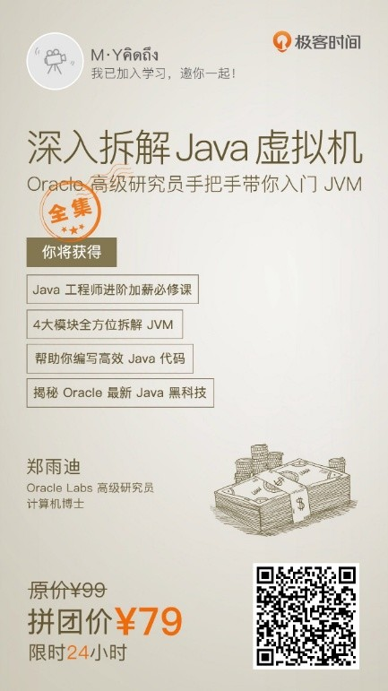

##### Java核心技术36讲 -- 杨晓峰

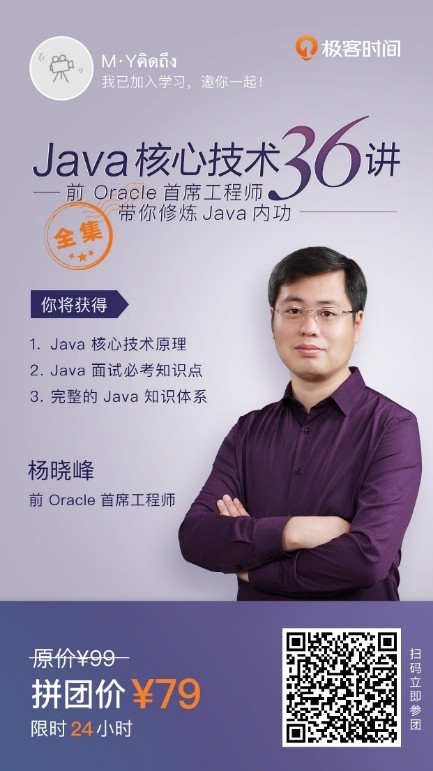

##### SQL必知必会 -- 陈旸

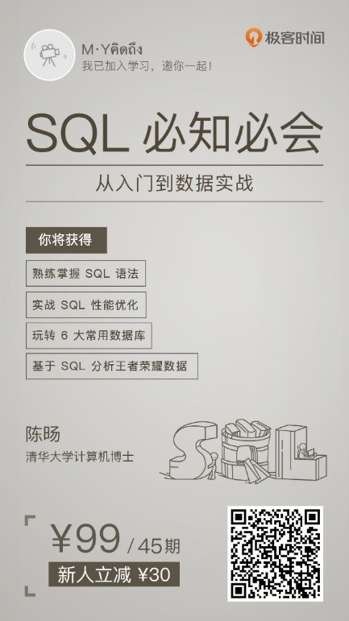

##### MySQL实战45讲 -- 林晓斌

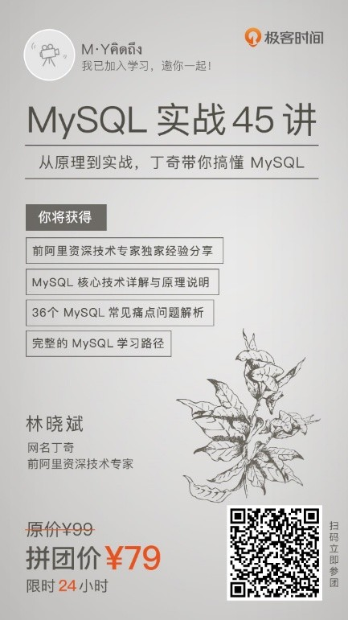

##### 趣谈Linux操作系统 -- 刘超（网易）

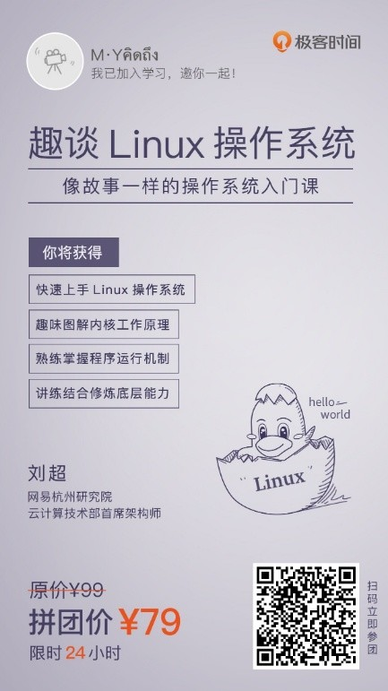

##### 深入拆解Tomcat & Jetty -- 李号双

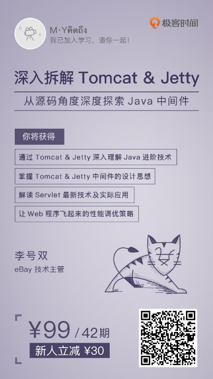

##### Python核心技术与实战 -- 景霄

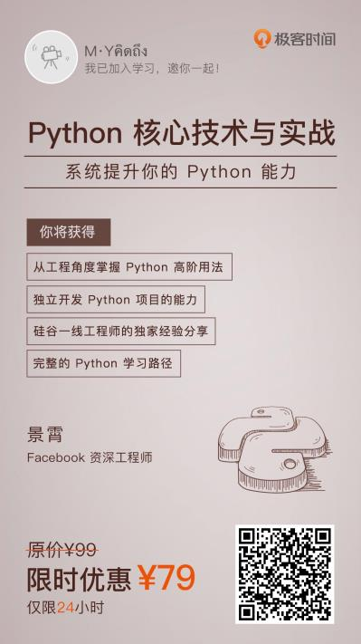

##### Java并发编程实战 -- 王宝令

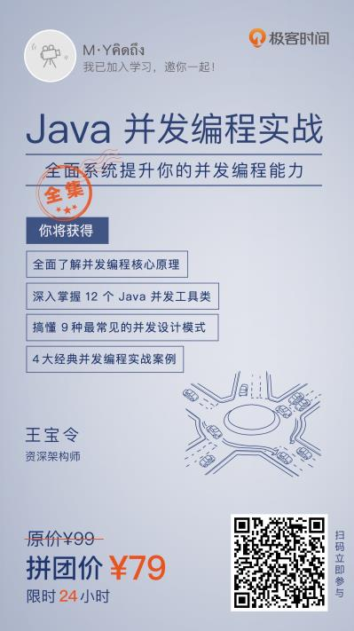

##### Java性能调优实战 -- 刘超（金山）

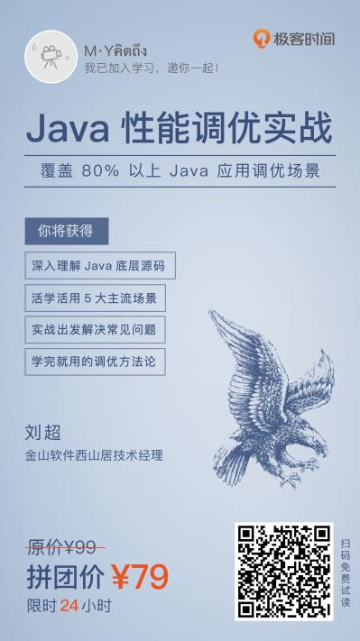

##### Linux性能优化实战 -- 倪朋飞


##### 从0开始学微服务 -- 胡忠想

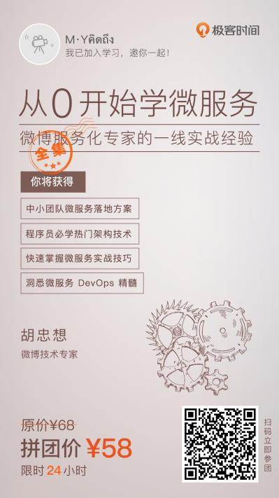

##### 深入剖析Kubernetes -- 张磊

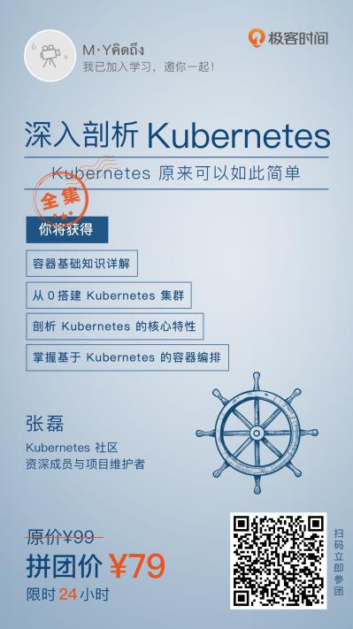

##### Kafka核心技术与实战 -- 胡夕

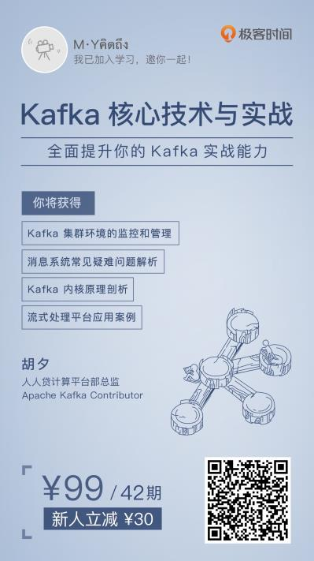

##### 持续交付36讲 -- 王潇俊


##### 技术管理实战36讲 -- 刘建国


# 视频

##### 算法面试通关40讲 -- 覃超


##### Web协议详解与抓包实战 -- 陶辉

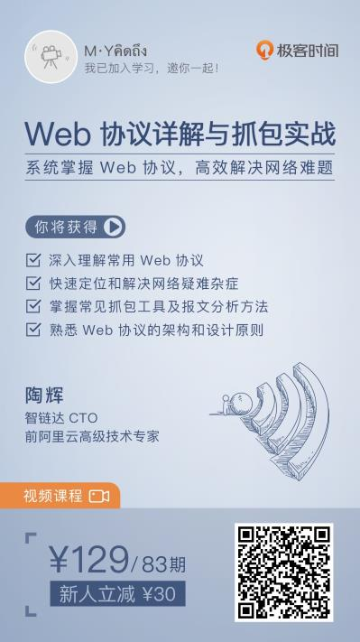

##### Linux实战技能100讲 -- 尹会生

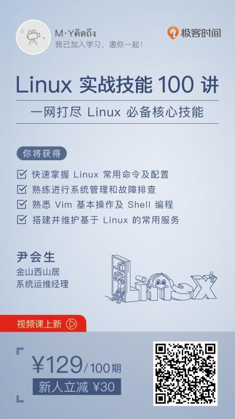

##### Nginx核心知识100讲 -- 陶辉


##### Elasticsearch核心技术与实战 -- 阮一鸣

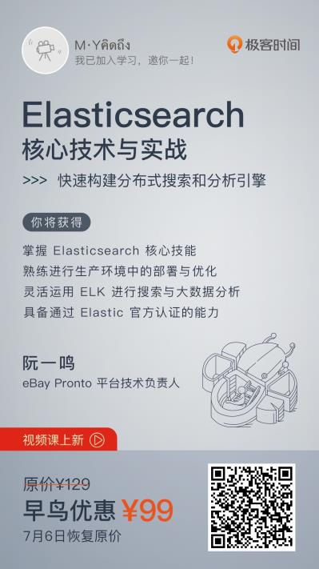